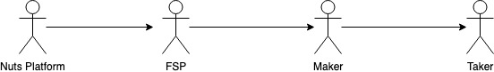

# Access Control Chain

Access control in the NUTS platform can be represented as a chain, as shown below.

In short,

* NUTS platform controls FSPs' access to NUTS platform by deciding who can create new instruments on NUTS platform;
* FSPs control makers' access to instruments by deciding who can create new issuance using the instruments created these FSPs as template;
* Makers control takers' access to issuance by deciding who can engage the issuance created by the makers.

There are various approaches to implement access control strategies on NUTS platform, and they are discussed in detail below.

### NUTS Platform to FSP

Access control from NUTS platform to FSP are implemented in Instrument Registry. It determines FSPs' qualification to create new instruments using both roles and NUTS token deposit.

### FSP to Maker

FSPs have the right to determine eligible makers and allows them to create new issuance using the instruments created by these FSPs. They could implement their access control strategies either in NUTS platform or in their instrument.

* When implementing access control in NUTS platform, FSPs can use the white listing mechanism provided Instrument Manager. The white list can be set during the instrument creation and updated afterwards;
* When implementing access control in instrument, FSPs can provide a **static white list** or a **static access control oracle address**.

### **Maker to Taker**

Makers have the right to determine eligible takers and allows them to engage the issuances created by the makers. The access control mechanism is fully implemented in instruments so that it relies on FSPs to provide access control mechanism in instruments. Below are some feasible access control implementation.

* FSPs can implement a white listing mechanism in instruments. Makers can provide the white listed address as part of issuance parameters and update them using custom actions afterwards;
* FSPs can define an interface for access control oracle. Maker can choose to implement the access control oracle on his own and then pass the address of access control oracle as issuance parameters.

