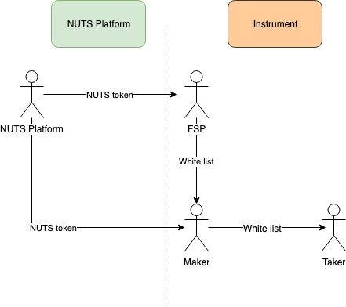

# Access Control

The diagram below depicts the access control topology in NUTS Platform. In short, the access control from NUTS Platform to FSP and maker are implemented by NUTS Platform, while the access control from FSP to maker and from maker to taker are implemented in instrument.

## NUTS Platform to FSP

NUTS Platform controls FSPs' access via NUTS token. When creating new financial instrument, FSPs are required to deposit certain amount of NUTS token. These NUTS tokens are returned when the financial instruments are deactivated.

## NUTS Platform to Maker

NUTS Platform controls makers' access via NUTS token. When creating new issuance of existing financial instruments, makers are required to deposit certain amount of NUTS token. These NUTS tokens are returned when the issuance enters INACTIVE state. Limited operations are allowed once an issuance enters INACTIVE state.

## FSP to Maker

FSP can determine who can create new issuance from the existing financial instrument. This can be done as white list. For example, the instrument can statically reference to an access control Oracle which determines the eligibility of makers. FSP can update the white list by updating the access control Oracle.

## Maker to Taker

Whether makers can determine who can engage their created issuance depends on the financial instrument implementation. For example, FSPs could implement a white list mechanism in the instrument. When creating a new issuance, makers can provide the white listed makers as issuance parameters. FSPs can support white list update as once of the custom operation.

