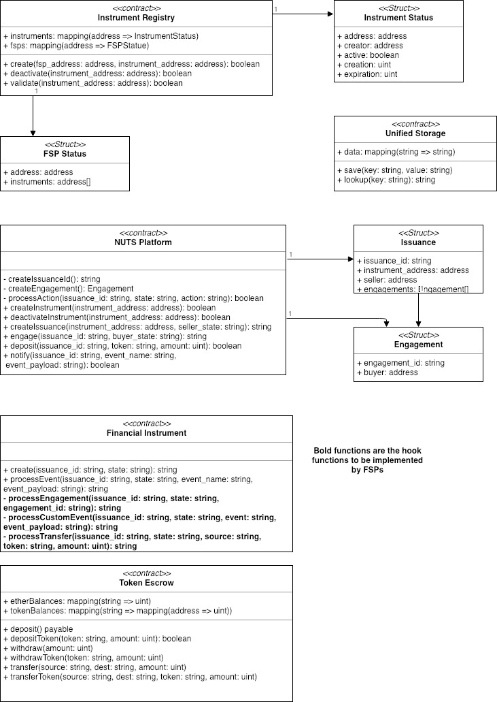

# Domain Model

This page depicts the domain model of the NUTS platform. It presents all key data elements as well as the interactions demonstrated in the interaction diagrams in the following pages.

## Unified Storage

A generic key-value store. Both key and value are strings.

## NUTS Token

A standard ERC20 token\(not shown the in the graph above\).

## Token Escrow

An extension of the standard [escrow](https://github.com/OpenZeppelin/openzeppelin-solidity/blob/master/contracts/payment/escrow/Escrow.sol) which implements withdrawal pattern and supports hosting of both Ether and any ERC20 tokens. The Token Escrow exposes two sets of API, one for Ether and one for other tokens.

* Ether
  * deposit\(\)
  * withdraw\(\)
  * transfer\(\)
* ERC20 Tokens
  * depositToken\(\)
  * withdrawToken\(\)
  * transferToken\(\)

The deposit\(\)/depositToken\(\)/withdraw\(\)/withdrawToken\(\) functions are used by sellers and buyers to send Ether/token to/from the escrow, while transfer\(\)/transferToken\(\) are used by NUTS platform to manipulate the token in the escrow; in most case, sending Ether/token to/from issuance.

## Instrument Registry

A registry that holds information about FSPs and financial instruments. Before creating new issuance of any financial instrument, NUTS platform will validate the status of the financial instrument using the validate\(\) function.

## Financial Instrument

A template to create new issuances. The financial instrument is singleton and stateless in nature as issuance id and state passed in in all function calls.

In order to achieve flexibility and extensibility, the financial instrument is event-driven and processEvent\(\) is the main entry to interact with this component. It provides the following hooks for FSP to implement custom logic in handling specific events:

* processEngagement\(\)
* processTransfer\(\)
* processCustomEvent\(\)

## NUTS Platform

The central portal for all NUTS operations.

