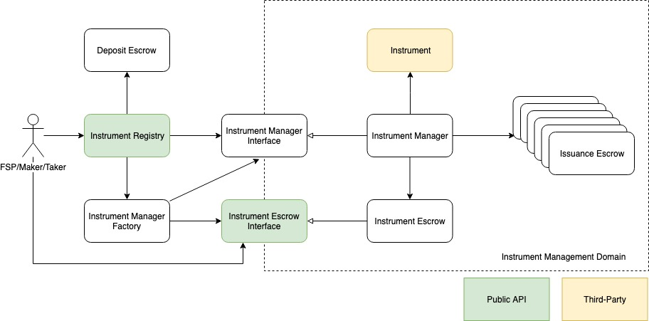

# Domain Model

Below is an overview of the NUTS Platform domain model.

As mentioned in the design principles, each financial instrument forms an isolated management domain that keeps all instrument data and assets. NUTS Platform creates and manages these instrument management domain, and delegates the actual instrument operation to these domain.

## Instrument Management Domain

NUTS Platform creates one isolated management domain for each financial instrument created on NUTS Platform. Each instrument management domain contains the following key components.

### Instrument

Instrument represents the financial instrument implemented underwritten by FSPs. It is deployed on Ethereum as a standalone smart contract, and then is registered as a financial instrument on NUTS Platform.

