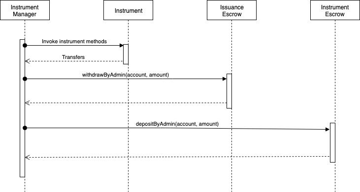

# Escrow

NUTS Platform, minus instrument management domain, does not keep any asset except NUTS token. All instrument assets are kept locally in their corresponding domain using escrow.

Each instrument management domain provides two kinds of escrows: Instrument Escrow, which serves as the asset portal of this instrument, and Issuance Escrow, which manages assets for individual issuance. They are all created by Instrument Manager, which is the owner of these escrows.

|  | Instrument Escrow | Issuance Escrow |
| :--- | :--- | :--- |
| Creation | Created when instrument is created | Created when issuance is created |
| Access by user | Deposit/Withdraw from their own account | Read-only |
| Access by instrument manager | Deposit/Withdraw from any account | Deposit/Withdraw from any account |
| Access by issuance | Read-only | Read-only |

## Common Functionality

The following functionalities are shared between Instrument Escrow and Issuance Escrow.

For any account, they can:

* Get ETH balance of individual user
* Get ERC20 token balance of individual user
* Get the list of ERC20 tokens deposited of individual user

This means everyone can view the balance information of any other users in both Instrument Escrows and Issuance Escrows.

For the escrow owner\(Instrument Manager\), it can:

* Withdraw ETH for any account
* Deposit ETH for any account
* Withdraw ERC20 token for any account
* Deposit ERC20 token for any account

Instrument Manager can deposit/withdraw assets for any account so that it could implement the following functionalities:

* Transfer assets from Instrument Escrow to Issuance Escrow
* Transfer assets from Issuance Escrow to Instrument Escrow
* Transfer assets between Issuance Escrows, e.g in issuance renewal

## Instrument Escrow

The Instrument Escrow is created along with the instrument management domain to keep user assets that are not yet locked by issuance. 

In order to deposit assets to individual issuance, users should deposit assets to Instrument Escrow first, and then invokes NUTS Platform API to transfer assets from Instrument Escrow to Issuance Escrow.

The following functionalities, in addition to the shared functionalities between instrument escrow and issuance escrow, are supported for any account:

* Deposit ETH for their own account
* Withdraw ETH for their own account
* Deposit ERC20 token for their own account
* Withdraw ERC20 token for their own account

## Issuance Escrow

The Issuance Escrow is created along with individual issuance to keep assets locked by issuance. 

Users/Issuances cannot deposit directly to/withdraw directly from Issuance Escrow; only Instrument Manager can do that. In short, instruments tells Instrument Manager what is the expected transfer to apply, then Instrument Manager complete the transfer on behalf of instrument.

For example, assume that an issuance wants to transfer 5 ETH of account A from Issuance Escrow to Instrument Escrow. In its return value, Instrument tells Instrument Manager this desired transfer action to take for the current issuance. Instrument Manager first withdraws 5 ETH from the corresponding Issuance Escrow, and then deposits this 5 ETH into Instrument Escrow. After this transfer, this 5 ETH is under account A's balance in Instrument Escrow, which means account A can withdraw it any time.

This transfer mechanism allows Instrument to perform asset transfers without taking direct actions to Issuance Escrow. While it's still Instrument's responsibility to ensure the desired transfer is legit, NUTS Platform ensures that Issuance Escrow is tempered with by Instruments.

As a summary, the following functionalities, in addition to the shared functionalities between instrument escrow and issuance escrow, are supported for Instrument Manager:

* Migrate ETH balance from one account to another
* Migrate ERC20 token balance from one account to another

The later allows Instrument Manager to change the ownership of an asset within an Issuance Escrow.

