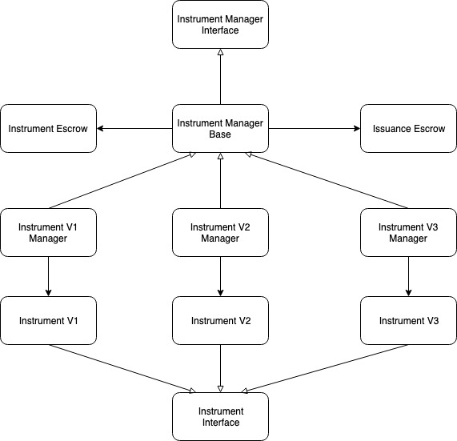

# Instrument Manager

Instrument Manager is the core of a financial instrument management domain. Its main functionalities include:

* Manage issuance assets using Issuance Escrows
* Manage issuance data using Issuance Storages
* Manage issuance lifecycle by delegating issuance operations to Instrument

## Instrument Manager Domain Model

As NUTS Platform is targeted to become a general financial instrument platform, it should be able to support financial instrument with various complexity and requirements in security, flexibility, ease of development, and etc. Therefore, NUTS Platform has defined multiple Instrument Interface to model the financial instrument and serve as the interface between Instrument Manager and Instrument. 

Currently NUTS Platform supports three Instrument Interface: Instrument v1, Instrument v2, and Instrument v3. Correspondingly, NUTS Platform also provides three Instrument Manager implementation: Instrument Manager v1, Instrument Manager v2, and Instrument Manager v3. They are described in detailed in the sub-pages.

## Instrument Interface

Even though there are multiple Interface Interfaces defined, they share the same set of operations but with different arguments:

* Create new issuance
* Engage existing issuance
* Deposit ETH/ERC20 tokens to existing issuance
* Withdraw ETH/ERC20 tokens from existing issuance
* Process scheduled event \(events notified by [Timer Oracle](../timer-oracle.md)\)
* Process custom event \(any other event triggered by maker/taker\)
* Renew issuance

## Instrument Manager Interface

Instrument Manager Interface is a single interface implemented by all Instrument Managers. Unlike Instrument Interfaces, there is only one Instrument Manager Interface and it defines the functionalities exposed by a financial instrument management domain.

Below are the list of issuance operations defined:

* Create new issuance
* Engage existing issuance
* Deposit ETH/ERC20 tokens to existing issuance
* Withdraw ETH/ERC20 tokens from existing issuance
* Process scheduled event \(events notified by [Timer Oracle](../timer-oracle.md)\)
* Process custom event \(any other event triggered by maker/taker\)
* Renew issuance

In short, there is a one-to-one relationship between Instrument Interface methods and the issuance operations defined in Instrument Manager Interface. Instrument Managers manage data and assets for individual issuance, and delegate the actual issuance operation to Instrument.

Instrument Manager Interface defines additional method in addition to issuance operations.

## Instrument Manager

Different Instrument Manager implementations differ in issuance data management but share the same issuance asset management logic.

