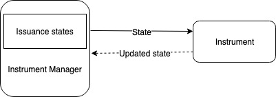

# Instrument V1

Instrument V1 treats issuance data as an opaque string. In all issuance operations, issuance data are passed in as a string parameter, and the updated issuance data are returned as a string. The issuance data are stored directly in Instrument Manager.

Instrument V1 is most secure among the three Instrument Interfaces. Since issuance data are passed in and returned as a whole string, no data mutation can be done without going through Instrument Manager. 

