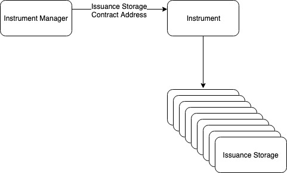

# Instrument V2

Instrument V2 creates a generic key-value storage contract for each issuance. 

The Issuance Storage contract support mappings of the following types:

* Integers
* Unsigned integers
* String
* Boolean

When Instrument methods are invoked, the Issuance Storage contract address is passed in as parameters, and Instrument is given a temporary write access to the Issuance Storage contract. When Instrument methods invocation finishes, the write access is revoked.

Instrument V2 is suitable for Instruments that need to handle more data than Instrument V1 and the Instrument developer favors an external storage approach. It provides security using temporary write access, but is still subject to reentrancy attack if the Instrument calls external third-party smart contracts. Therefore, it's not as secure as Instrument V1.

