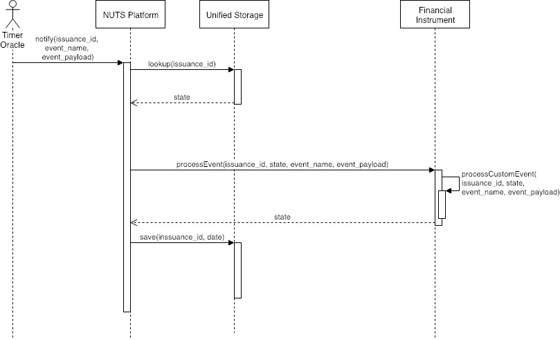

# Interaction - Timer Oracle

### Timer Oracle Design

The Timer Oracle is an external Oracle service which notifies NUTS platform of scheduled events. It works by monitoring two events emitted:

* **InstrumentCreated**\(address indexed instrumentAddress, address indexed fspAddress\), emitted by NUTS Platform;
* **EventScheduled**\(uint256 indexed issuanceId, uint256 timestamp, string eventName, string eventPayload\), emitted by specific instruments.

The Timer Oracle retrieves the addresses of all created instruments from the InstrumentCreated events, and then monitor the EventScheduled events from each instrument.

Each instrument emits only limited number of event. For example, each Loan issuance emits at most five events:

* deposit\_expired
* engagement\_expired
* collateral\_expired
* load\_expired
* grace\_period\_expired

None of these events has event payload. As the number of issuances is not significantly large, we can safely hold all events information in memory, but also leverage persistent storage to save the event notification history.

All unprocessed scheduled events are sorted by their timestamp in a priority queue. New events are put into the queue. A periodic task is run every 10 minutes\(Do we need a different time interval?\) to perform the following task:

1. Check if any event is due; if not, skip step 2 & 3;
2. For each event due, notifies the NUTS platform with the event information, including issuance id, timestamp, event name and event payload;
3. If the result is success, update the event status to be NOTIFIED; otherwise, , update the event status to be FAILED.

### Timer Oracle Implementation

#### Database

Two AWS DynamoDB databases are created:

* ScheduleEvent: Used to persist all scheduled event information, including the event notification information such as transaction hash and transaction error;
* Config: Used to store sensitive config information. Currently consists of two entries
  * timer-oracle-wallet-content: The content of the wallet file for Timer Oracle
  * timer-oracle-wallet-password: The password of the wallet file for Timer Oracle

#### Deployment

The Timer Oracle is deployed as a single Kubernetes pod with two containers:

* Geth container, which is an Ethereum node;
* Timer oracle container, which runs the Timer Oracle runnable.

Note 1: We define event due as the current time must be at least 10 minutes from the event scheduled time. According to the [docs](http://www.ethdocs.org/en/latest/network/connecting-to-the-network.html#common-problems-with-connectivity), a time drift of 12 seconds should lead to disconnect to the Ethereum peers. Here we use a conservative value of 10 minutes to make sure that the events are not notified before they are due.

Note 2: The tuple \(issuance id, timestamp, event name\) uniquely identifies an event.

