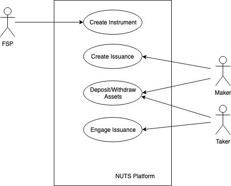

# Architecture

There are three actors in NUTS Platform:

* Financial Service Providers \(FSPs\), who are the underwriters of financial instruments. Usually Underwriters of specialized financial instruments or Blockchain Foundation;
* Maker, who is creator of a specific financial instrument issuance. For example, a maker can create a unique instance of a loan instrument underwritten by FSP; 
* Taker, who is engager of the financial instrument issuance created by the maker. For instance, a taker can engage a specific loan instance created by the maker.

NUTS Platform allows FSPs to easily create and activate new financial instruments and deactivate existing financial instruments in a trustless and transparent fashion.

Once a new financial instrument is activated, NUTS Platform allows makers to create new issuance of selected financial instrument activated by FSPs. Once a new issuance is created, one or more takers could engage the issuance and complete the issuance

The following sections provides an overview of NUTS Platform's architecture design.

