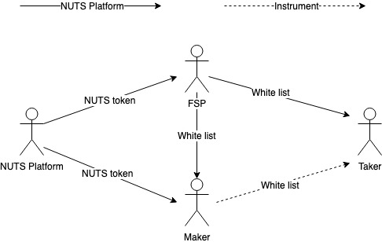

# Access Control

The diagram below depicts the access control topology in NUTS Platform. In short, the access control from NUTS Platform to FSP and maker are implemented by NUTS Platform, while the access control from FSP to maker and from maker to taker are implemented in instrument.

## NUTS Platform to FSP

NUTS Platform controls FSPs' access via NUTS token. When creating new financial instrument, FSPs are required to deposit certain amount of NUTS token. These NUTS tokens are returned when the financial instruments are deactivated.

NUTS token deposit and return are implemented in Instrument Registry.

## NUTS Platform to Maker

NUTS Platform controls makers' access via NUTS token. When creating new issuance of existing financial instruments, makers are required to deposit certain amount of NUTS token. These NUTS tokens are returned when the issuance enters INACTIVE state. No operation is allowed once an issuance enters INACTIVE state.

NUTS token deposit and return are implemented in Instrument Manager.

## FSP to Maker

FSP can determine who can create new issuance from the existing financial instrument. Instrument Manager provides a Maker Whitelist for FSPs so that they can set the list of eligible makers.

In activating new financial instrument on NUTS platform, FSPs need to set whether this instrument uses maker whitelist. Once set, FSP can add account to the maker whitelist or remove account from the maker whitelist. Maker whitelist must be enabled in activating new financial instrument and cannot be updated in the future.

## FSP to Taker

FSP can determine who can engage existing issuances. Instrument Manager provides a Taker Whitelist for FSPs so that they can set the list of eligible takers.

In activating new financial instrument on NUTS platform, FSPs need to set whether this instrument uses taker whitelist. Once set, FSP can add account to the taker whitelist or remove account from the taker whitelist. Taker whitelist must be enabled in activating new financial instrument and cannot be updated in the future.

## Maker to Taker

Whether makers can determine who can engage their created issuance depends on the financial instrument implementation. For example, FSPs could implement a white list mechanism in the instrument. When creating a new issuance, makers can provide the white listed makers as issuance parameters. FSPs can support white list update as once of the custom operation.

