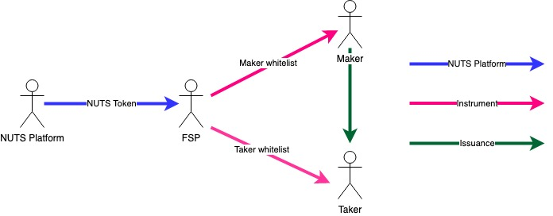

# Access Control

The section describes the access control model in NUTS Platform. The image below depicts the access control topology.

As stated in section [Domain Model](domain-model-1.md),  FSPs can activate financial instruments on NUTS Platform to serve makers and takers. It's natural for NUTS Platform to control FSPs' access to NUTS Platform. This is done via NUTS token, which is deposited to the activated instrument and burned when instrument is deactivated. The amount of NUTS token to deposit is a global configuration parameters.

Within an activated instrument, FSP can optionally grant access to makers and takers via maker and taker whitelist. This is supported by Instrument where FSPs can update the whitelist at any time. This whitelist affects the newly created issuances and engagements but does not affect the existing ones. FSP can also charge service fees from makers and takers by specifying service token, service address and fee receiver address. In a word, instrument is the place where FSPs could enforce access control strategies.

Within an issuance, maker could also decide who are eligible takers. This could be done via custom maker properties which customizes the issuance. Takers' access control from maker is implemented in issuance. This is purely issuance-specific and NUTS Platform currently does not provide any standardized solutions.

