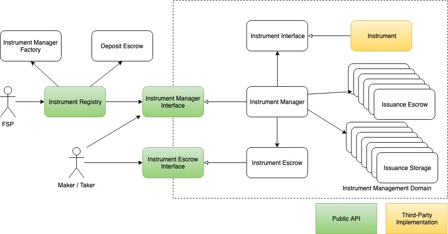

# Domain Model

The diagram is an overview of the NUTS Platform domain model.

As mentioned in the design principles, each financial instrument forms an isolated management domain that keeps all instrument data and assets. Instrument Registry creates and maintains these instrument management domain, while the actual issuance operations are invoked directly on instrument management domain.

## Inside Instrument Management Domain

NUTS Platform creates one isolated management domain for each financial instrument activated on NUTS Platform. Each instrument management domain has two entry points: Instrument Manager, which is the issuance operation entry, and Instrument Escrow, which is the instrument assets entry.

### Instrument

Instrument represents the financial instrument implemented underwritten by FSPs. It is deployed on Ethereum as a standalone smart contract, and then is activated on NUTS Platform.

Instrument Interfaces, which are designed by NUTS Platform, defines the Instrument model and serves as the interface between Instrument Manager and Instrument implementation. In order to address different complexity and requirements of different financial instruments, NUTS Platform has defined multiple Instrument Interfaces and new Instrument Interfaces might be introduced in the future. One Instrument must implement one of the Instrument Interface.

Instrument is designed to be stateless, and reacts to events from Instrument Manager in order to drive issuance state change.

### Instrument Escrow

Instrument Escrow is singleton in one instrument management domain. It keeps assets that are not locked by issuance, and serves as the portal for any account to deposit and withdraw assets into the instrument management domain. More details about Instrument Escrow can be found in section [Escrow](../implementation/escrow.md).

### Issuance Escrow

One Issuance Escrow is created for each issuance. It keeps assets that are locked by issuance. Only Instrument Manager can deposit to/withdraw from the Issuance Escrow. Instrument Manager can also change the ownership of assets in the Issuance Escrow. More details about Issuance Escrow can be found in section [Escrow](../implementation/escrow.md).

### Issuance Storage

As Instrument is designed to be stateless, issuance data must be kept separately and isolated with each other. Therefore, a dedicated storage is needed for each issuance. The Issuance Storage implementation varies depending on the Instrument Interface implemented. More details about Issuance Storage can be found in section [Instrument Manager](../implementation/instrument-manager/).

### Instrument Manager

Instrument Manager is the core of one instrument management domain. There is only Instrument Manager per instrument management zone, and serve the following functionalities:

* Manage Instrument Escrow and Issuance Escrows;
* Manage issuance data;
* Delegate issuance operations to Instrument.

The Instrument Manager implementation varies depending on the Instrument Interface implemented. Usually there is one Instrument Manager implementation for each Instrument Interface. More details about Instrument Manager can be found in section [Instrument Manager](../implementation/instrument-manager/).

## Outside Instrument Management Domain

NUTS Platform, minus Instrument Management Domains, are lightweight and dedicated for the following functionalities:

* Instrument management
* NUTS token management

### Instrument Manager Factory

The task of Instrument Manager Factory is to create Instrument Management Domain for individual Instruments. As stated above, Instrument Manager implementation varies depending on the Instrument definition. Instrument Manager Factory hides the complexity of creating new Instrument Management Domain, and will upgrade when Instrument Manager is upgraded or new Instrument Manager implementation is added.

### Deposit Escrow

Deposit Escrow is a simple smart contract that is used to keep the deposited NUTS token. It can be use to keep:

* NUTS token deposited by FSPs in creating new financial instrument;
* NUTS token deposited by makers in creating new issuance.

### Instrument Registry

Instrument Registry serves as the central registry for financial instruments. It keeps information about all financial instrument domains.

For FSPs, they can:

* Create new financial instruments
* Deactivate existing financial instruments

