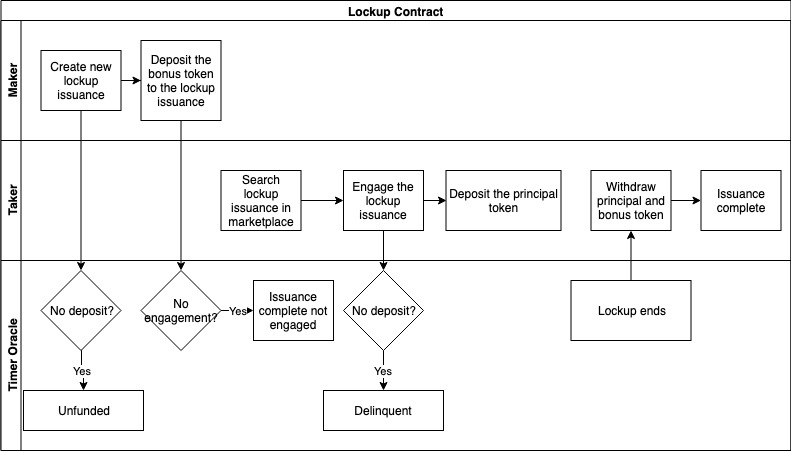
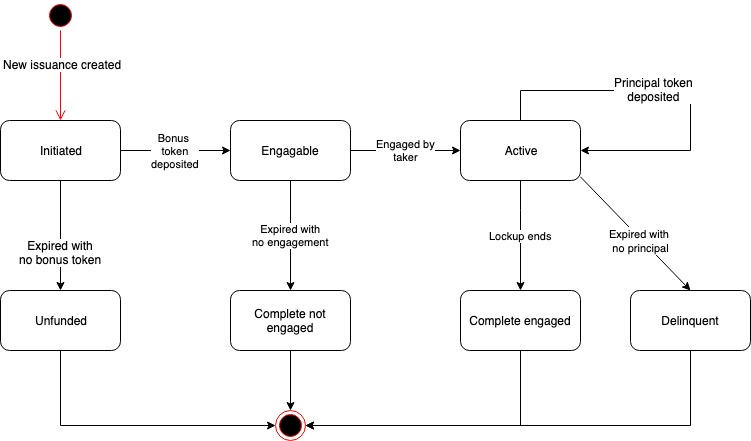

# Lockup Instrument

## Use Case Description

The system allows makers to create new lockup issuance, and allows takers to engage the existing lockup issuance.

## Actors

* Maker, who is the asset seller of the lockup. Usually the Foundation who wants to stabilize the market price of the token asset;
* Taker, who is the asset purchaser of the lockup. Usually the token investor;
* Timer Oracle, who is an external timer service provider that provides timing triggers to NUTS technology platform.

## Precondition

* Financial Service Providers have created the lockup instruments using the NUTS protocol;

## Process Flow

The process flow of the Lockup contract is shown below.

### Main Process Flow

* Maker creates new issuance of lockup instrument;
* Maker deposits the bonus token to the lockup issuance;
* Taker engages the lockup issuance;
* Taker deposits the principal token to the lockup issuance;
* When the lockup ends, the taker can retrieve both the principals and the bonus token.

### Alternative Process Flow

* If maker does not deposit the bonus token in time, the issuance becomes unfunded;
* If taker does not deposit the principal token in time, the issuance becomes delinquent;
* If there is no engagement in time, the issuance completes with no engagement.

## Issuance States

Below are the possible states of a lockup contract.

* Initiated: The lockup issuance is created;
* Engageable: The maker deposits the bonus token;
* Active: The taker engages the lockup issuance;
* Complete Engaged: The lockup period ends with principal token deposited in time;
* Unfunded: The maker fails to deposit the bonus token in time;
* Complete not Engaged: No taker engages in time;
* Delinquent: The taker fails to deposit principal token in time.

