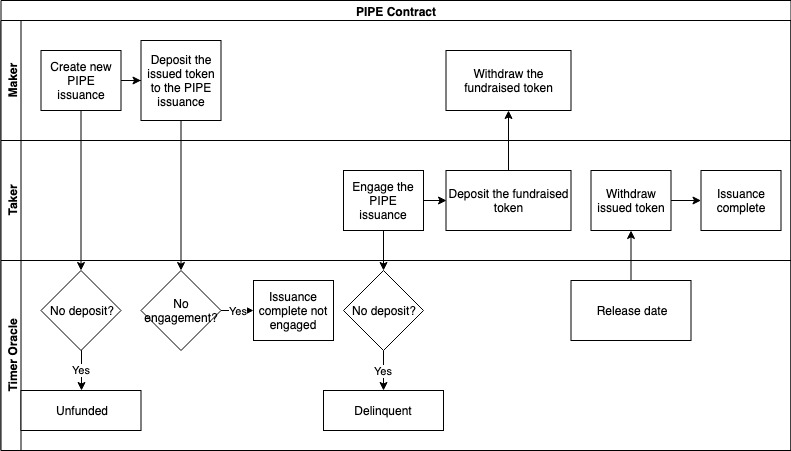
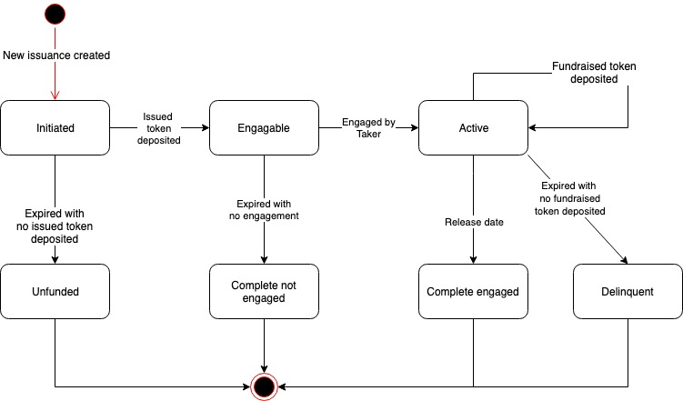

# PIPE Instrument

## Use Case Description

The system will allow makers to create new Private Investment in Public Equity \(aka. PIPE\) issuances, and allow takers to engage existing PIPE issuance.

## Actors

* Maker, who is the asset seller of the PIPE. Usually the Foundation who wants financing from the token assets;
* Taker, who is the asset purchaser of the PIPE. Usually the token investor;
* Timer Oracle, who is an external timer service provider that provides timing triggers to NUTS technology platform.

## Precondition

* Financial Service Providers have created the PIPE instruments using the NUTS protocol;

## Process Flow

### Main Process Flow

* Maker creates new issuance of PIPE instrument;
* Maker deposits the issued token to the PIPE issuance;
* Taker engages the PIPE issuance;
* Taker deposits the fundraised token to the PIPE issuance. The fundraised token is  available for withdrawal by maker;
* When the release date arrives, the issued token is available for withdrawal by the taker.

### Alternative Process Flow

* If maker fails to deposit the issued token in time, the issuance becomes unfunded;
* If taker fails to deposit the fundraised token in time, the issuance becomes delinquent;
* If there is no engagement in time, the issuance completes with no engagement.

## Issuance States

Below are the possible states of a PIPE contract:

* Initiated: The PIPE issuance is created;
* Engageable: The maker deposits the issued token;
* Active: The taker engages the PIPE issuance;
* Complete Engaged: The release date arrived with fundraised token deposited;
* Unfunded: The maker fails to deposit the issued token in time;
* Complete not Engaged: No taker engages in time;
* Delinquent: The taker fails to deposit fundraised token in time.

