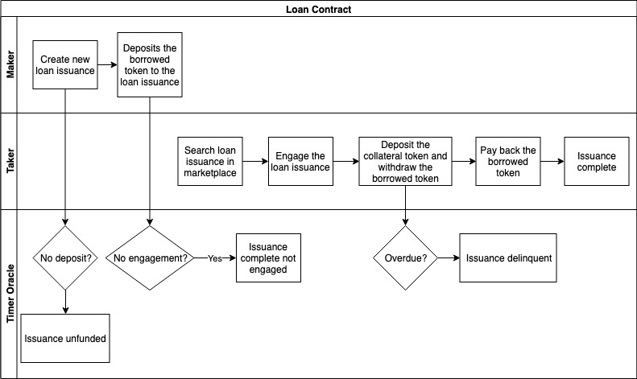
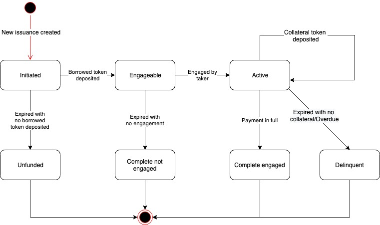

# ACoconut - Loan Contract

## Use Case Description

The system will allow Makers to create new loan issuance, and allow Takers to engage the outstanding loan .

## Actors

* Maker, who is the lender of the loan. Usually the Foundation who wants to provide liquidity to token investors;
* Taker, who is the borrower of the loan. Usually the token holders who want liquidity;
* Timer Oracle, who is an external timer service provider that provides timing triggers to the loan contract.

## Preconditions

* Financial Service Providers have created loan instruments on the NUTS Technology Platform;

## Process Flow

The diagram below depicts the process flow of the loan contract.

### Main Process Flow

* Maker creates new loan issuance using the selected loan instrument;
* Maker deposits the borrowed token to the loan issuance;
* Taker searches loan issuance in the marketplace and engages to the target issuance;
* Taker deposits the collateral token. The borrowed token is available for withdrawal by the taker;
* Taker pays back the borrowed token plus interest token; the collateral token is available for withdrawal by the taker.

### Alternative Process Flow

* If the maker fails to deposit the borrowed token in time, the loan issuance becomes unfunded;
* If the loan contract expires with no engagement, the loan issuance becomes complete with no engagement and will not be available for further engagement;
* If the taker fails to pay back the borrowed token plus interest, the loan issuance becomes delinquent.

## Loan States

Below are the states of a loan contract.

* Initiated: The loan issuance is created;
* Engageable: The maker has deposited the borrowed token so that the loan issuance can be engaged by taker;
* Active: The taker engages the loan issuance;
* Complete Engaged: The taker pays back the borrowed token in time;
* Unfunded: The maker fails to deposit the borrowed token in time;
* Complete not Engaged: The issuance expires with no engagement;
* Delinquent
  * The taker fails to deposit the collateral token in time;
  * The taker fails to pay back the borrowed token in full in time.

