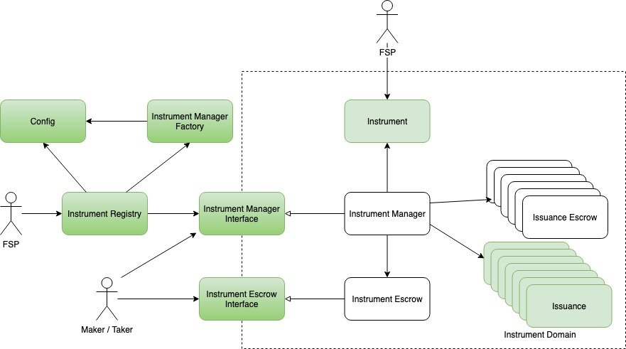

# Architecture

The image below shows the architecture of NUTS Platform.

NUTS Platform consists of an Instrument Registry with multiple independent financial instrument domains. The Instrument Registry maintains a mapping from instrument id to instrument domain. It's also the place where FSPs could activate new financial instrument. During the activation process, a new financial instrument domain is created by Instrument Manager Factory. The Config provides NUTS Platform-wide configurations.

Each instrument domain, as denoted by dotted line above, is built around a financial instrument.  It consists of several key components:

* Instrument Manager, which is the pivot of the instrument domain. It manages all issuances as well as all assets in this instrument domain. It's also the Facade where makers and takers can interact with the instrument domain;
* Instrument, which is the access point for FSPs. FSPs who creates this financial instrument can manages all issuances by setting instrument-wide parameters. For example, FSPs could update maker and taker whitelist in instrument and thus controls who are eligible makers and takers. However, FSPs cannot directly operates on individual issuances. Instrument is also the issuance factory which creates individual issuance instance;
* Issuance, which defines the business logic of the financial instrument. Each time a new issuance is created, a new issuance instance is created by instrument. After that, Instrument Manager takes over the ownership of issuance and is the sole component that interact with issuance instance within this instrument domain. Issuance might query instrument contract to get instrument-wide parameters, such as maker/taker whitelist and maker/taker service fees;
* Instrument Escrow, which is a singleton in an instrument domain and manages all assets that are not locked by issuances. Users must deposit assets directly into Instrument Escrow in order to create or engage issuances in this domain;
* Issuance Escrow, which is one per issuance and helps individual issuance lock its assets. When an issuance locks an asset, it's transferred from Instrument Escrow from Issuance Escrow and while an asset is unlocked by issuance, it's transferred from Issuance Escrow back to Instrument Escrow.

