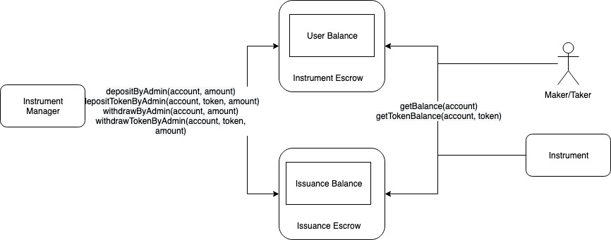

# Common Functionalities

The following functionalities are shared between Instrument Escrow and Issuance Escrow.

The following functions are implemented in both Instrument Escrow and Issuance Escrow and can be invoked by any account:

* getBalance\(address account\)
  * Get ETH balance of individual user
* getTokenBalance\(address account, IERC20 token\)
  * Get ERC20 token balance of individual user
* getDepositTokens\(address account\)
  * Get the list of ERC20 tokens deposited of individual user

This means any account can view the balance information of any other account in both Instrument Escrows and Issuance Escrows.

The following functions are implemented in both Instrument Escrow and Issuance Escrow and can be only invoked by owner\(i.e. Instrument Manager\):

* depositByAdmin\(address account\)
  * ETH is transferred from owner to the escrow
  * The deposited ETH is added to the account's balance
* withdrawByAdmin\(address account, uint256 amount\)
  * ETH is transferred from the escrow to owner
  * The withdrawn ETH is reduced from the account's balance
* depositTokenByAdmin\(address account, address token, uint256 amount\)
  * ERC20 token is transferred from owner to the escrow
  * The deposited token is added to the account's balance
* withdrawTokenByAdmin\(address account, address token, uint256 amount\)
  * ERC20 token is transferred from the escrow to owner
  * The deposited token is reduced from the account's balance

Instrument Manager can deposit/withdraw assets for any account so that it could implement the following functionalities:

* Transfer assets from Instrument Escrow to Issuance Escrow
* Transfer assets from Issuance Escrow to Instrument Escrow
* Transfer assets between Issuance Escrows, e.g in issuance renewal

