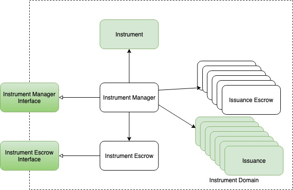

# Instrument Manager

Instrument Manager is the pivot of an instrument domain, as shown in section [Architecture](./).

Instrument Manager has several major responsibilities:

Instrument Manager owns and manages Instrument Escrow and all Issuance Escrow in this domain. It can deposit assets to or withdraw assets from the escrows. When an issuance wants an asset transfer to perform, it tells Instrument Manager the details about the transfer action. Instrument Manager completes the actual asset transfer. Such design can keep issuances from common attacks caused by vulnerability of issuances, such as reentrancy attack.

Instrument Manager owns and manages all Issuances in this domain. Once an issuance instance is created by instrument, it's owned and operated by Instrument Manager.

Instrument Manager acts as the portal of the instrument domain. 

* When maker wants to create a new issuance, it invokes Instrument Manager for issuance creation. Instrument Manager will create a new issuance instance via instrument and create a new Issuance Escrow via Escrow Factory;
* When maker/taker wants to interact with the existing issuances, they invokes Instrument Manager which in turn deletes the actual processing to the target issuance instance;
* Service Provider who creates the instrument domain can also deactivate the instrument from Instrument Manager.

Using Instrument Manager as instrument domain portal is enforced by the fact that Instrument Manager is the sole component that could operate on the assets in escrows. When the actual processing is delegated to issuance instance, the issuance instance returns the list of transfer actions that Instrument Manager should perform. If the issuance contract has any vulnerability, attackers might be able to change state of the issuance but they cannot touch the assets in escrows.

