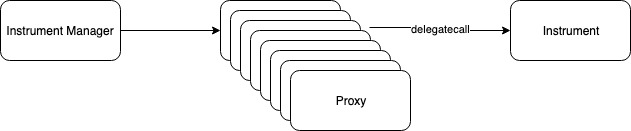

# Instrument Type III

Instrument Type III adopts Proxy contracts to keep issuance data. While traditional Proxy pattern uses Proxy contract to separate logic and storage, Instrument V3 uses Proxy pattern to separate Issuance data.

When invoking Instrument methods, Instrument Manager does that through the Proxy contracts which delegates calls to Instrument. Each issuance has a dedicated Proxy which keeps data for that issuance.

Instrument Type III allows any Instrument data layout and is thus more flexible than Instrument Type II. In order to enforce access control, only Instrument Manager can invoke methods on Proxy contracts. It's also subject to reentrancy attack and thus suitable for trusted FSPs.

