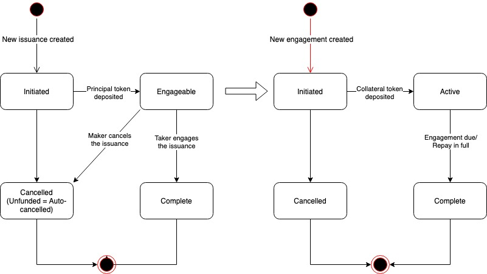

# Lending

The lending instrument allows makers to lend out their assets and expect interest as return. Takers can deposit their collateral in order to seize the lending assets, and they are expected to return both principal and interest when the lending is due.

Currently, the lending instrument is 1 to 1 only, which means one lending issuance can be engaged by only one taker.

## Lending Lifecycle

The image below shows the lifecycle of lending issuance and engagement.

* When a lending issuance is created and the principal token is deposited, the lending issuance becomes Engageable;
* When a taker engages the lending issuance, a lending engagement is created and the lending issuance becomes Complete with a completion ratio of 10000;
* When maker cancels an Engageable lending issuance, the lending issuance becomes Cancelled and the deposited principal token is returned;
* When taker deposits the collateral token, the engagement is Active and the principal token is transferred to taker;
* When the lending engagement is due or taker repays in full\(principal + interest\), the engagement becomes Complete. Lending issuance defines a lending-specific engagement property to determine whether it's Complete as it's due or repaid.

## Lending Parameters

The lending instrument is highly customizable. It defines a set of parameters which allows both Service providers and makers to customize the lending instrument and its issuances.

### Lending Service Provider Parameters

The following parameters allow Service Provider to customize the lending instrument. They are all defined in the lending instrument contract.

| Lending Instrument Parameter | Description | Default |
| :--- | :--- | :--- |
| Max issuance duration | Maximum life of the issuance in seconds | 14 days |
| Min issuance duration | Minimum life of the issuance in seconds | 0 |
| Max tenor days | Maximum life of the engagement in days | 90 |
| Min tenor days | Minimum life of the engagement in days | 2 |
| Max collateral ratio | Maximum collateral ratio with 4 decimals\(0.01%\) | 200% |
| Min collateral ratio | Minimum collateral ratio with 4 decimals\(0.01%\) | 50% |
| Max interest rate | Maximum interest rate with 6 decimals\(0.0001%\) | 5.0000% |
| Min interest rate | Minimum interest rate with 6 decimals\(0.0001%\) | 0.0010% |

### Lending Maker Parameters

The following parameters allow makers to customize the lending issuance. They are defined as the maker data in creating new lending issuance.

| Lending Issuance Parameters | Description |
| :--- | :--- |
| Issuance duration | Duration of the issuance in seconds |
| Lending token address |  |
| Lending amount |  |
| Collateral token address |  |
| Collateral ratio | The ratio of collateral to principal |
| Tenor | The duration of engagement in seconds |
| Interest rate | The per day interest rate to pay in principal |

## Lending Custom Property

### Lending Issuance Custom Property

The lending issuance defines a set of custom property. It includes all the maker parameters shown in the previous section with an additional field:

* Interest amount: The computed interest amount to pay

### Lending Engagement Custom Property

The lending engagement also defines a set of custom properties.

* Loan state: The state of the loan. Could be Unpaid/Repaid/Delinquent. It's useful to identify whether a lending issuance is Complete because it's due or it's repaid.
* Collateral amount: The actual collateral amount deposited. For lending engagement, the actual collateral value is computed at the time of engagement using the price oracle. Therefore, it's part of the lending engagement property.

