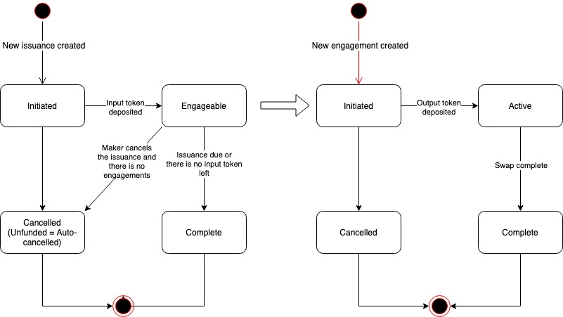

# Multi-Swap

The Multi-Swap instrument allows makers to post their intend for a token exchange. Taker can engage the issuance and complete the exchange.

The Multi-Swap instrument is similar to Swap but it allows multiple engagements to the same issuance. Maker defines the expected input token amount and output amount. When a taker engages with output token less than the expected output amount, the proportional amount of input token is swapped.

## Multi-Swap lifecycle

The image below shows the lifecycle of Multi-Swap issuance and engagement.

* When a multi-swap issuance is created and the input token is deposited, the multi-swap issuance becomes Engageable;
* When a taker engages the multi-swap issuance and deposits the output token
  * If there is enough input token remaining, the multi-swap engagement is created and Complete with input token transferred to taker and output token transferred to maker
  * If there is not enough input token remaining, the engagement transaction will fail
  * If there is no input token left after this engagement, the multi-swap issuance is Complete
* When maker cancels an Engageable multi-swap issuance and there is no engagement, the multi-swap issuance becomes Cancelled and the deposited input token is returned;
* When the multi-swap issuance is due, the multi-swap is Complete and remaining input tokens are returned.

## Multi-Swap Parameters

The multi-swap instrument is highly customizable. It defines a set of parameters which allows both Service providers and makers to customize the multi- instrument and its issuances.

### Multi-Swap Service Provider Parameters

The following parameters allow Service Provider to customize the multi-swap instrument. They are all defined in the multi-swap instrument contract.

| Multi-Swap Instrument Parameter | Description | Default |
| :--- | :--- | :--- |
| Max issuance duration | Maximum duration of the issuance in seconds | 90 days |
| Min issuance duration | Minimum duration of the issuance in seconds | 2 days |

### Multi-Swap Maker Parameters

The following parameters allow makers to customize the multi-swap issuance. They are defined as the maker data in creating new multi-swap issuance.

| Multi-Swap Issuance Parameter | Description |
| :--- | :--- |
| Issuance duration | The duration of issuance in seconds |
| Input token address |  |
| Input amount |  |
| Output token address |  |
| Output amount |  |
| Max engagement output amount | Maximum output amount for individual engagement |
| Min engagement output amount | Minimum output amount for individual engagement |

### Multi-Swap Taker Parameters

The following parameter allows takers to customize the multi-swap engagement. They are defined as taker data in engaging multi-swap issuance.

| Multi-Swap Engagement Parameter | Description |
| :--- | :--- |
| Engagement output amount | The amount of output token in this engagement |

## Multi-Swap Custom Property

### Multi-Swap Issuance Custom Property

The multi-swap issuance defines a set of custom property. It includes all the maker parameters shown in the previous section with the addition of one field:

* Remaining input token: The amount of input token remaining in the Issuance Escrow

### Multi-Swap Engagement Custom Property

The multi-swap engagement defines the following custom property:

* Output amount: The amount of output token deposited in this engagement.

