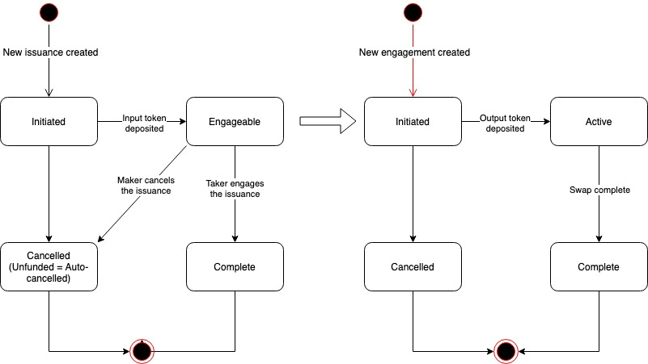

# Swap

The Swap instrument allows makers to post their intend for a token exchange. Taker can engage the issuance and complete the exchange.

The swap instrument is 1 to 1 only, which means one swap issuance can be engaged by only one taker.

## Swap lifecycle

The image below shows the lifecycle of swap issuance and engagement.

* When a swap issuance is created and the input token is deposited, the swap issuance becomes Engageable;
* When a taker engages the swap issuance and deposits the output token
  * The swap issuance is Complete with a completion ratio of 10000
  * The swap engagement is created and Complete;
  * The input token is transferred to taker and the output token is transferred to maker
* When maker cancels an Engageable swap issuance, the swap issuance becomes Cancelled and the deposited input token is returned.

## Swap Parameters

The swap instrument is highly customizable. It defines a set of parameters which allows both Service providers and makers to customize the swap instrument and its issuances.

### Swap Service Provider Parameters

The following parameters allow Service Provider to customize the swap instrument. They are all defined in the swap instrument contract.

| Swap Instrument Parameter | Description | Default |
| :--- | :--- | :--- |
| Max issuance duration | Maximum duration of the issuance in seconds | 90 days |
| Min issuance duration | Minimum duration of the issuance in seconds | 2 days |

### Swap Maker Parameters

The following parameters allow makers to customize the swap issuance. They are defined as the maker data in creating new swap issuance.

| Swap Issuance Parameter | Description |
| :--- | :--- |
| Issuance duration | The duration of issuance in seconds |
| Input token address |  |
| Input amount |  |
| Output token address |  |
| Output amount |  |

## Swap Custom Property

### Swap Issuance Custom Property

The swap issuance defines a set of custom property. It includes all the maker parameters shown in the previous section.

### Swap Engagement Custom Property

The swap engagement does not define any custom property.

