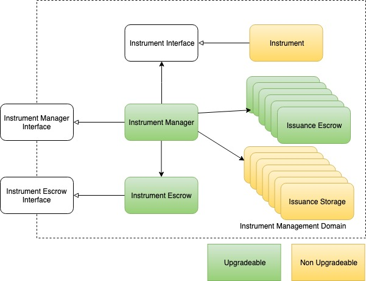
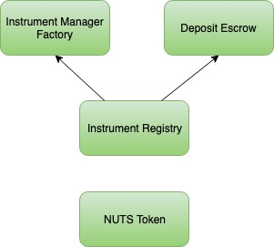

# Platform Upgrade

Key components of NUTS Platform are all upgradeable. NUTS Platform adopts Proxy to support logic upgrade and Protocol Buffer to support data structure upgrade.

Proxy and external storage are two most widely adopted upgrade mechanism. NUTS Platform favors proxy over external storage due the following reasons:

* With external storage contract, each upgrade introduces a new Ethereum address. This indicates updating all contracts that have access to the upgraded contract. The customer-facing DApp also need to update to the new logic contract address;
* The permission update will be a pain. In case the logic contract has access permission to lots of other smart contracts, updating the logic contract with external storage requires handing over all its permissions to the new logic contract;
* External storage contract is not flexible and it requires lots of logic change. For example, it provides a generic key-value mapping for all types but does not work well with arrays.

## Upgrading Instrument Management Domain

Instrument Manager, Instrument Escrow and Issuance Escrow are all fronted with Proxies. This means that their logic are always upgradeable. Currently only NUTS Platform admin can perform the upgrade, but the decision-making might become more decentralized in the future.

Instrument is not upgradeable. It defined the business logic of a financial instrument and must be final once activated. If FSPs want to introduce new business logic, it should be deployed as a new smart contract and activated as a new financial instrument.

Issuance Storage is not upgradeable. They are designed to be lightweight, and helps separating logic and data.

## Upgrading Instrument Manager Factory

If any key components require an upgrade on their logic, or a new type of Instrument Interface is defined \(e.g. Instrument V4\), then Instrument Manager Factory needs to be upgraded as well as it encapsulates all the complexities of creating Instrument Management Domain.

Instrument Manager Factory does not require a Proxy as it's stateless in its nature. After a new Instrument Manager Factory is deployed to Ethereum, Instrument Registry only need to update its reference to the new Instrument Manager Factory.

## Upgrading Instrument Registry, Deposit Escrow and NUTS Token

Instrument Registry, Deposit Escrow and NUTS Token are all fronted by Proxy and thus all upgradeable. Only NUTS Platform admin can perform the upgrade.

