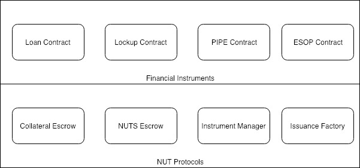

# Project Definition

The project consists of two sub-projects: The NUTS Finance project and the ACoconut project.

The NUTS Finance project is building a financial contract issuance platform; a set of protocols deployed on public blockchain networks that aims to:

* Enables Financial Service Providers to create financial instruments on the blockchain;
* Enables Sellers to create specific issuances using the financial instruments provided by FSPs;
* Enable Buyers to engage financial issuances created by Sellers.

ACoconut is a standalone Financial Service Provider that aims to implement the following digital financial instruments using the NUTS Technology Platform:

* Loan contract
* Lock-up contract
* PIPE contract
* ESOP contract

Below is a tentative depiction of the project deliverables. Note that this diagram only serves as an example and does not reflect the final design.

