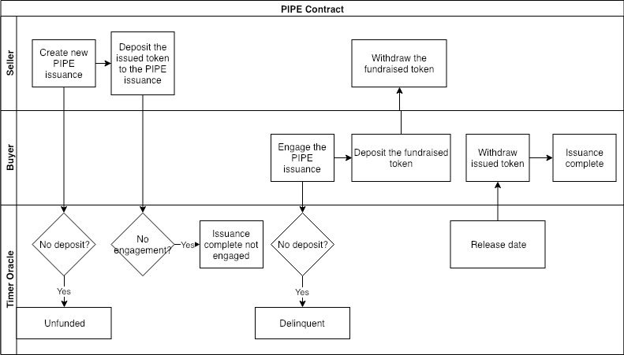
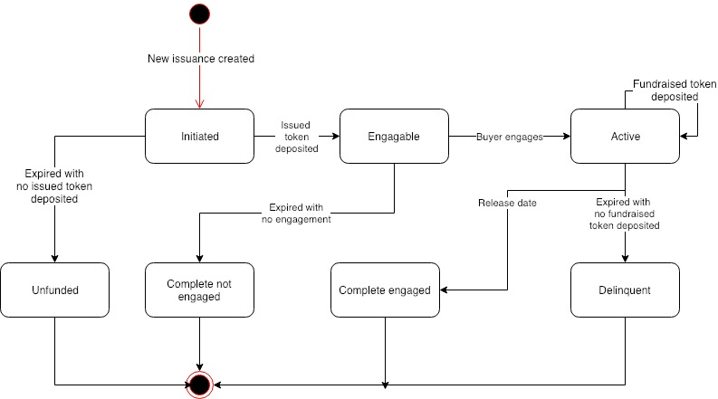

# ACoconut - PIPE Contract

## Use Case Description

The system will allow sellers to create new Private Investment in Public Equity \(aka. PIPE\) issuances, and allow buyers to engage existing PIPE issuance.

## Actors

* Seller, who is the asset seller of the PIPE. Usually the Foundation who wants financing from the token assets;
* Buyer, who is the asset purchaser of the PIPE. Usually the token investor;
* Timer Oracle, who is an external timer service provider that provides timing information.

## Precondition

* Financial Service Providers have created the PIPE instruments using the NUTS protocol;

## Process Flow

### Main Process Flow

* Seller creates new issuance of PIPE instrument;
* Seller deposits the issued token to the PIPE issuance;
* Buyers engages the PIPE issuance;
* Buyers deposits the fundraised token to the PIPE issuance. The fundraised token is  available for withdrawal by seller;
* When the release date arrives, the issued token is available for withdrawal by the buyer.

### Alternative Process Flow

* If seller fails to deposit the issued token in time, the issuance becomes unfunded;
* If buyer fails to deposit the fundraised token in time, the issuance becomes delinquent;
* If there is no engagement in time, the issuance completes with no engagement.

## Issuance States

Below are the possible states of a PIPE contract:

* Initiated: The PIPE issuance is created;
* Engageable: The seller deposits the issued token;
* Active: The buyer engages the PIPE issuance;
* Complete Engaged: The release date arrived;
* Unfunded: The seller fails to deposit the issued token in time;
* Complete not Engaged: No buyer engages in time;
* Delinquent: The buyer fails to deposit fundraised token in time.

