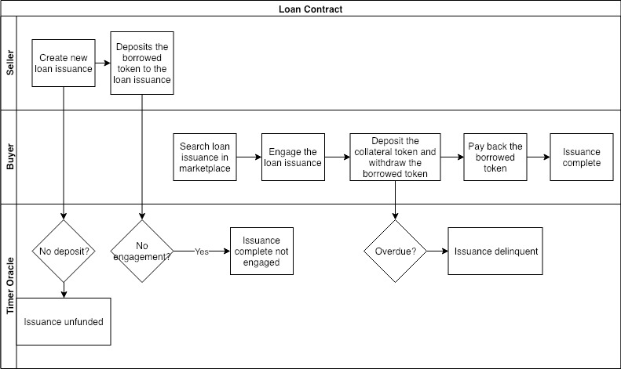

# ACoconut - Loan Contract

## Use Case Description

The system will allow Sellers to create new loan issuance, and allow Buyers to engage the outstanding loan .

## Actors

* Seller, who is the lender of the loan. Usually the Foundation who wants to provide liquidity to token investors;
* Buyer, who is the borrower of the loan. Usually the token holders who want liquidity;
* Timer Oracle, who is an external timer service provider that provides timing information to the loan contract;

## Preconditions

* Financial Service Providers have created loan instruments using the NUTS Technology Platform;

## Process Flow

The diagram below depicts the process flow of the loan contract. The link to edit the diagram is [here](https://www.draw.io/#G1S6LxTrcGlYD7EfgmeOWYG0lHIAxV_mXP).

### Main Process Flow

* Seller creates new loan issuance using the selected loan instrument;
* Seller deposits the borrowed token to the loan issuance;
* Buyer searches loan issuance in the marketplace and engages to the target issuance;
* Buyer deposits the collateral token. The borrowed token is available for withdrawal by the buyer;
* Buyer pays back the borrowed token plus interest token; the collateral token is available for withdrawal by the buyer.

### Alternative Process Flow

* If the seller fails to deposit the borrowed token in time, the loan issuance becomes unfunded;
* If the loan contract expires with no engagement, the loan issuance becomes complete with no engagement and will not be available for further engagement;
* If the buyer fails to pay back the borrowed token plus interest, the loan issuance becomes delinquent.

## Loan States

Below are the states of a loan contract.

* Initiated: The loan issuance is created;
* Engageable: The seller has deposited the borrowed token so that the loan issuance can be  engaged by buyer;
* Active: Buyer engages the loan issuance;
* Complete Engaged: Buyer pays back in time;
* Unfunded: The sellers fails to deposit the borrowed token in time;
* Complete not Engaged: The issuance expires with no engagement;
* Delinquent
  * The buyer fails to deposit the collateral;
  * The buyer fails to pay back the borrowed token in full in time.

