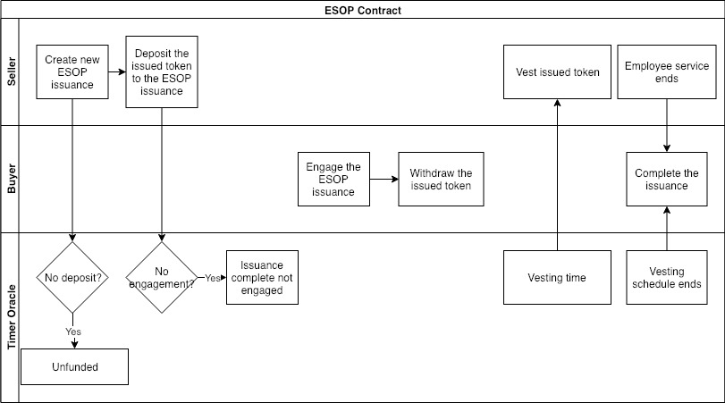
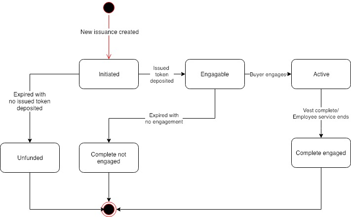

# ACoconut - ESOP Contract

## Use Case Description

The system will allow sellers to create new Employee Stock Option Plan \(ESOP\) issuances, and allow buyers to engage existing ESOP issuance.

## Actors

* Seller, who is the asset seller of the ESOP issuance. Usually the Foundation who wants to incentivize employees;
* Buyer, who is the asset purchaser of the ESOP issuance. Usually the Foundation employee;
* Timer Oracle, who is an external timer service provider that provides timing information.

## Precondition

* Financial Service Providers have created the ESOP instruments using the NUTS protocol;

## Process Flow

### Main Process Flow

* Seller creates new issuance of ESOP instrument;
* Seller deposits the issued token to the ESOP issuance;
* Buyers engages the ESOP issuance;
* Seller vests issued tokens according to the vesting schedule;
* Buyer can withdraw the issued token that is already vested.

### Alternative Process Flow

* If seller does not deposit the issued token in time, the issuance becomes unfunded;
* If there is no engagement in time, the issuance completes with no engagement.

## Issuance States

Below are the possible states of an ESOP contract:

* Initiated: The ESOP issuance is created;
* Engageable: The seller deposits the issued token;
* Active: The buyer engages the ESOP issuance;
* Complete Engaged: The vesting schedule completes or the employee service ends;
* Unfunded: The seller fails to deposit the issued token in time;
* Complete not Engaged: No buyer engages in time;

