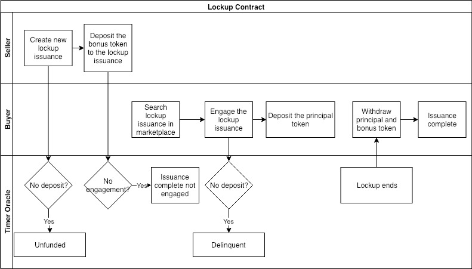
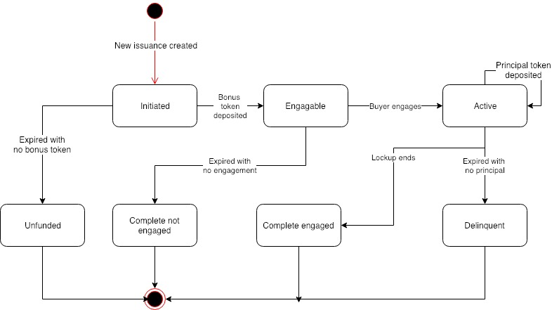

# ACoconut - Lockup Contract

## Use Case Description

The system allows sellers to create new lockup issuance, and allows buyers to engage the existing lockup issuance.

## Actors

* Seller, who is the asset seller of the lockup. Usually the Foundation who wants to stabilize the market price of the token asset;
* Buyer, who is the asset purchaser of the lockup. Usually the token investor;
* Timer Oracle, who is an external timer service provider that provides timing information.

## Precondition

* Financial Service Providers have created the lockup instruments using the NUTS protocol;

## Process Flow

### Main Process Flow

* Seller creates new issuance of lockup instrument;
* Seller deposits the bonus token to the lockup issuance;
* Buyers engages the lockup issuance;
* Buyers deposits the principal token to the lockup issuance;
* When the lockup ends, the buyers can retrieve both the principals and the bonus token.

### Alternative Process Flow

* If seller does not deposit the bonus token in time, the issuance becomes unfunded;
* If buyer does not deposit the principal token in time, the issuance becomes delinquent;
* If there is no engagement in time, the issuance completes with no engagement.

## Issuance States

Below are the possible states of a lockup contract.

* Initiated: The lockup issuance is created;
* Engageable: The seller deposits the bonus token;
* Active: The buyer engages the lockup issuance;
* Complete Engaged: The lockup period ends;
* Unfunded: The seller fails to deposit the bonus token in time;
* Complete not Engaged: No buyer engages in time;
* Delinquent: The buyer fails to deposit principal token in time.

